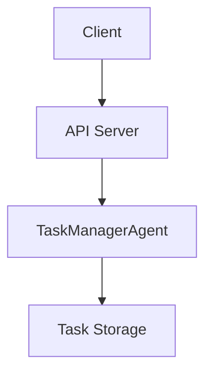
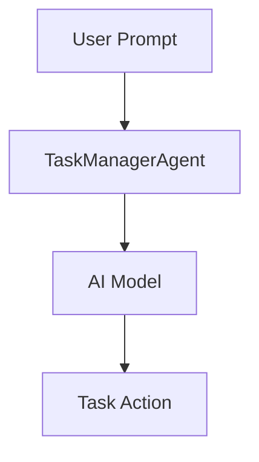
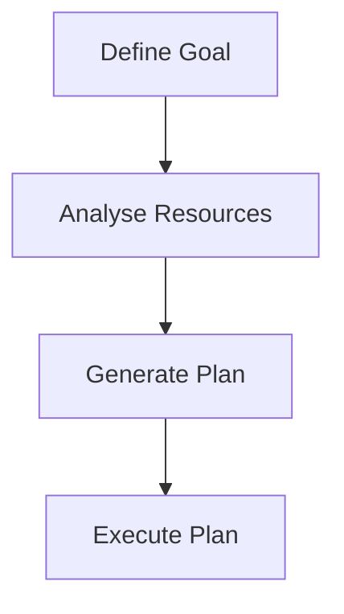

# Agent Task Manager

Agent Task Manager is an intelligent task management system that leverages AI to manage tasks dynamically. It can add, delete, and list tasks based on user prompts, making it a versatile tool for task automation.

## Table of Contents
- [Overview](#overview)
- [Usage](#usage)
- [Architecture](#architecture)

## Overview
The Agent Task Manager is designed to automate task management using AI. It interacts with users through prompts to perform actions such as adding, deleting, or listing tasks. The system is built using a Durable Object architecture, ensuring stateful interactions and scalability.

## Usage
To start the project locally, use the following command:
```
npx nx dev agent-task-manager
```

### NPM Scripts
- **deploy**: Deploys the application using Wrangler.
```
npx nx deploy agent-task-manager
```
- **dev**: Starts the development server.
```
npx nx dev agent-task-manager
```
- **lint**: Lints the source code and throws errors on warnings.
```
npx nx lint agent-task-manager
```
- **start**: Starts the application in development mode.
```
npx nx start agent-task-manager
```
- **test**: Runs the test suite.
```
npx nx test agent-task-manager
```
- **test:ci**: Runs the test suite in CI mode.
```
npx nx test:ci agent-task-manager
```
- **type-check**: Performs TypeScript type checking.
```
npx nx type-check agent-task-manager
```

### API Interaction
The project exposes an API endpoint to interact with the task manager:

- **POST /**: Interact with the task manager agent.
  - **Request**:
    ```json
    {
      "agentId": "string",
      "prompt": "string"
    }
    ```
  - **Response**:
    ```json
    {
      "message": "string",
      "task": {
        "id": "string",
        "title": "string",
        "description": "string",
        "completed": "boolean",
        "createdAt": "number"
      }
    }
    ```
  - **Curl Command**:
    ```bash
    curl -X POST \
    -H "Content-Type: application/json" \
    -d '{"agentId": "your-agent-id", "prompt": "your-prompt"}' \
    http://localhost:8787/
    ```

## Architecture
The Agent Task Manager is structured as a cloud-based application using Durable Objects to maintain state across sessions. The main components include the TaskManagerAgent, which handles task operations, and the API server, which facilitates communication with clients.

### System Diagram


### Agentic Patterns
The project utilizes the following agentic patterns:

#### Tool Use Pattern
The TaskManagerAgent dynamically interacts with AI models to process user prompts and manage tasks.



#### Planning Pattern
The agent formulates plans to manage tasks based on user input, ensuring efficient task handling.



This README provides a comprehensive guide to understanding and using the Agent Task Manager project, highlighting its capabilities and architecture.

<!-- Last updated: 038947bb9b4fd6d8d05f28479e966cd36b43658e -->
